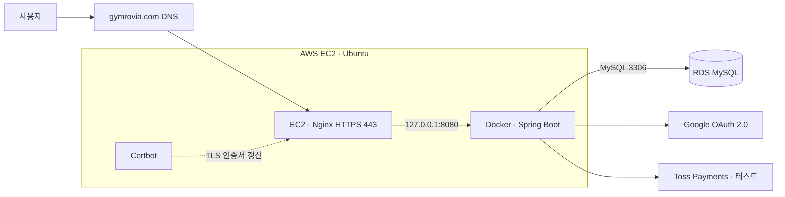

# Gymrovia

[서비스 바로가기](https://gymrovia.com) · [설계 문서](https://app.notion.com/p/Gym-Management-System-6454d948da9c835bb3b501c48f3d275b)

Gymrovia는 회원, 회원권·결제, 출석, 예약, 운동, 시설 업무를 한곳에서 처리하는 헬스장 운영 관리 웹 애플리케이션입니다. 관리자·트레이너·회원 역할별 화면과 접근 권한을 제공합니다.

> 개인 포트폴리오용 서비스입니다. 결제는 Toss Payments 테스트 환경으로 제공하며, 실제 운영용 관리자 계정은 공개하지 않습니다.

## 프로젝트 개요

| 항목 | 내용 |
| --- | --- |
| 핵심 기능 개발 | 2026.07.29 ~ 2026.09.02 |
| 최초 배포 | 2026.09.03 — 배포 환경 오류 수정 및 주요 기능 검증 |
| 개발 인원 | 1명, 개인 프로젝트 |
| 담당 범위 | 기획, 요구사항 정의, DB 설계, 백엔드, 화면 구현, 테스트, AWS 배포·운영 환경 구성 |
| 프로젝트 형태 | Spring Boot 기반 헬스장 운영 관리 시스템 |

## 주요 기능

### 관리자

- 운영 대시보드와 매출·출석 통계 조회
- 회원 등록·조회·수정 및 트레이너 배정
- 회원권 상품과 회원별 회원권 관리
- 현장 결제, Toss Payments 결제 및 전체·부분 환불 관리
- 출석 체크인·체크아웃과 센터 QR 발급
- 트레이너 일정 예약 생성·수정·상태 관리
- 시설과 점검 이력 관리
- 알림 조회 및 읽음 처리

### 트레이너

- 담당 회원 목록과 상세 정보 조회
- 회원별 운동 루틴 작성·수정·삭제
- 일일 운동 기록 작성·수정·삭제
- 트레이너 프로필 관리

### 회원

- 보유 회원권과 결제·환불 내역 조회
- Toss Payments 결제창을 통한 회원권 결제
- QR 기반 체크인·체크아웃
- 운동 루틴 조회와 운동 기록 작성·수정
- 프로필 및 비밀번호 변경
- 알림 조회

## 주요 화면

> 아래 실행 화면은 이름 변경 전 촬영한 자료입니다. 현재 화면의 브랜드는 Gymrovia이며, 이미지는 재촬영 후 교체할 예정입니다.

| 로그인 | 관리자 대시보드 |
| --- | --- |
|  |  |

| 트레이너 홈 | 회원 홈 |
| --- | --- |
|  |  |

### 회원 홈 상세


역할별 전체 화면 설계와 구현 범위는 [Notion 설계 문서](https://app.notion.com/p/Gym-Management-System-6454d948da9c835bb3b501c48f3d275b)에서 확인할 수 있습니다.

## 기술적 개선 요약

| 주제 | 적용 내용 |
| --- | --- |
| 결제 정합성 | 승인 후 저장 실패 시 보상 취소, 멱등성 키, 재확인이 필요한 주문 상태 보존 |
| 환불 정합성 | PG 취소 결과 검증 후 로컬 반영, 전액 환불 시 회원권 취소 |
| 예약 동시성 | 트레이너 행 잠금 후 일정 중복 검사 |
| 오류 응답 | 일반 화면은 HTML, API는 공통 JSON으로 분리 |
| 배포 환경 차이 | MySQL 테이블명 대소문자 일치, 결제 만료 응답에 시간대 오프셋 적용 |
| 출석 시간 | 한국 시간 기준 처리와 날짜 집계, 기존 기록은 시간 기준을 추정해 일괄 변경하지 않음 |

## 기술 스택

| 구분 | 기술 |
| --- | --- |
| Backend | Java 17, Spring Boot 4.0.7, Spring MVC |
| Security | Spring Security, Google OAuth 2.0 |
| Persistence | MyBatis, MySQL, Flyway |
| Frontend | Thymeleaf, HTML, CSS, JavaScript |
| Payment | Toss Payments API·SDK |
| Build & Test | Gradle, JUnit 5, Mockito, H2 |
| Deployment | Docker, Docker Hub, AWS EC2, Amazon RDS |
| Network & TLS | Nginx, 도메인 DNS, Let's Encrypt · Certbot |

## 운영 아키텍처



- DNS는 EC2 탄력적 IP를 가리키며 Nginx가 HTTPS 요청을 앱에 전달합니다.
- 앱의 8080 포트는 localhost에 바인딩합니다. RDS는 퍼블릭 액세스를 비활성화하고 EC2 보안 그룹에서의 DB 접근을 허용합니다.
- 운영 환경변수는 서버에서 주입하고 비밀번호·시크릿은 저장소에 포함하지 않습니다.
- Flyway로 DB 변경 이력을 관리합니다. 기존 데이터 보존과 마이그레이션 호환성은 [DB 문서](docs/db/README.md)를 참고하세요.

## 배포 및 검증

**현재는 수동 Docker 배포입니다.** 로컬 테스트 → 이미지 빌드·Docker Hub push → EC2 pull·컨테이너 교체 → Flyway 로그·Health Check → 기능 확인 순서로 진행합니다. Git push만으로 운영 서버가 갱신되지는 않습니다.

| 구분 | 2026.09.03 확인 결과 |
| --- | --- |
| 인증 | 일반·Google 로그인 및 Google 가입 흐름 |
| 결제 | 테스트 결제·회원권 활성화·전액 환불, Toss 취소 상태와 금액 일치 |
| 출석 | QR 입실·퇴실·이용 시간, 한국 시간 표시, 관리자 화면 반영 |
| HTTPS | 인증서 적용, 갱신 모의 테스트 성공, 자동 갱신 타이머 등록 |
| 운영 설정 | 컨테이너 재시작 정책, Docker·Nginx 자동 시작, RDS 백업·보안 그룹, 비용 알림 |

실제 서버 재부팅과 백업 복원 훈련은 아직 수행하지 않았습니다. 컨테이너 교체 시 잠시 중단될 수 있으며, DB 변경 후에는 구버전 이미지로의 단순 교체만으로 안전한 복구가 보장되지 않습니다.

## 애플리케이션 구조

기능별 도메인 패키지 구조를 사용하며 기본 처리 흐름은 다음과 같습니다.

```text
Controller → Service → Mapper → XML Mapper → MySQL
                         ↓
                    External Gateway
```

- `Controller`: 화면·API 요청 처리와 입력 검증
- `Service`: 비즈니스 규칙과 트랜잭션 경계 관리
- `Mapper / XML Mapper`: MyBatis 기반 데이터 접근과 SQL 관리
- `Gateway`: Toss Payments 등 외부 시스템 연동
- `Scheduler`: 결제 주문 만료 및 QR 임시 데이터 정리
- `GlobalExceptionHandler`: 일반 화면과 API 오류 응답 분리

세부 구조는 [PROJECT_STRUCTURE.md](PROJECT_STRUCTURE.md)에서 확인할 수 있습니다.

## 테스트 범위

- 핵심 서비스 비즈니스 규칙 단위 테스트
- 결제 승인 실패와 승인 후 저장 실패 보상 테스트
- Toss Payments 환불 요청 및 로컬 상태 반영 테스트
- 역할별 접근 제어 테스트
- 일반 화면과 API 예외 응답 분리 테스트
- 트레이너 예약 잠금과 일정 충돌 차단 테스트
- 결제 만료 시간대, 출석 시간·자정 경계·기존 기록 보존 테스트

```powershell
.\gradlew.bat test
```

## 실행 방법

### 사전 준비

- Java 17
- MySQL 8
- Toss Payments 테스트 API 개별 연동 키
- Google OAuth 클라이언트

### 데이터베이스 준비

DB 스키마는 Flyway로 관리합니다. 신규 환경에서는 빈 MySQL 데이터베이스를 만든 뒤 접속 환경변수를 설정하고 애플리케이션을 실행하면 `src/main/resources/db/migration`의 마이그레이션이 자동 적용됩니다.

로컬 시연 데이터가 필요하면 마이그레이션 완료 후 `docs/db/sample-data.sql`을 선택적으로 실행합니다. `docs/db/schema.sql`은 전체 구조 확인과 수동 초기화를 위한 참고 파일이며, 기존 테이블을 제거하므로 데이터가 있는 DB에는 실행하지 않습니다.

기존 DB의 Flyway 등록과 변경 적용 방법은 [DB 설정 문서](docs/db/README.md)를 참고하세요.

### 환경변수

프로젝트 루트의 `.env` 파일 또는 IDE 실행 설정에 다음 값을 지정합니다. 실제 키와 비밀번호는 Git에 커밋하지 않습니다.

```properties
DB_URL=jdbc:mysql://localhost:3306/gym_management
DB_USERNAME=사용자명
DB_PASSWORD=비밀번호
GOOGLE_CLIENT_ID=Google 클라이언트 ID
GOOGLE_CLIENT_SECRET=Google 클라이언트 시크릿
TOSS_CLIENT_KEY=Toss 테스트 클라이언트 키
TOSS_SECRET_KEY=Toss 테스트 시크릿 키
```

```powershell
.\gradlew.bat bootRun
```

## 향후 개선

- GitHub Actions 기반 자동 테스트, 이후 배포 자동화 검토
- 백업 복원·재부팅 복구 훈련과 장애 알림 보완
- Gymrovia 브랜드 기준 화면 재촬영 및 시연 영상 정리

## 문서

- [Notion 설계 문서](https://app.notion.com/p/Gym-Management-System-6454d948da9c835bb3b501c48f3d275b)
- [프로젝트 구조](PROJECT_STRUCTURE.md)
- [API 명세](docs/api-spec.md)
- [인증 흐름](docs/auth-flow.md)
- [데이터베이스 설정 및 마이그레이션](docs/db/README.md)

