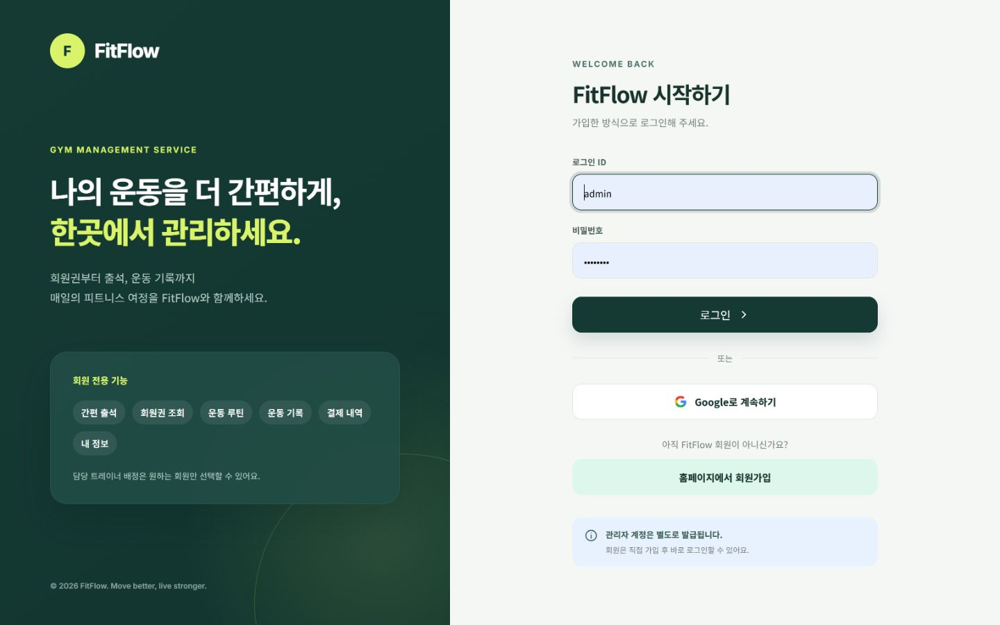
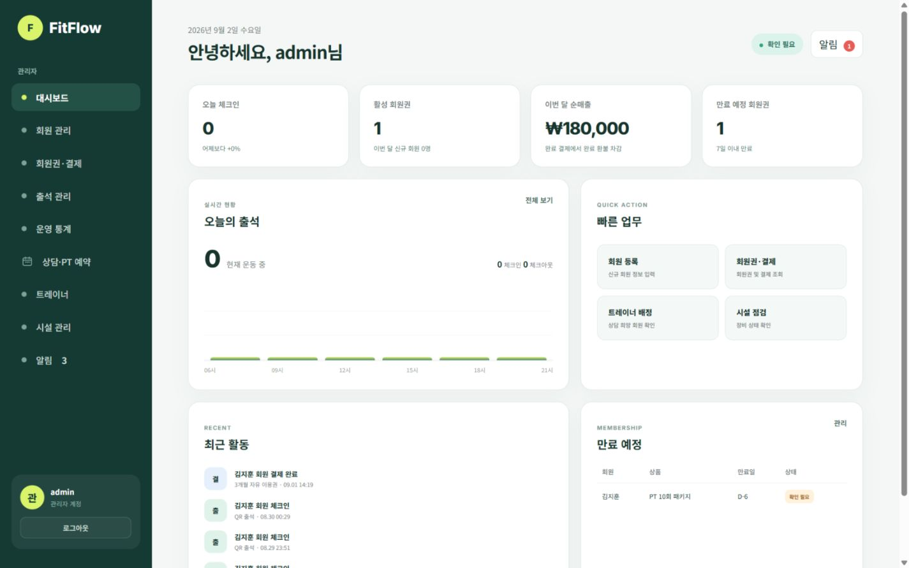
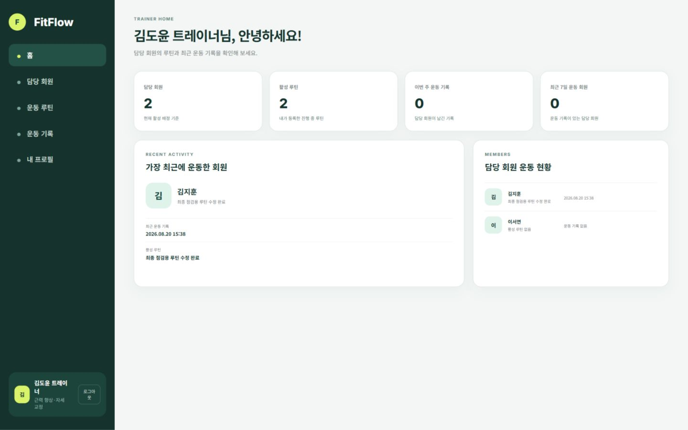
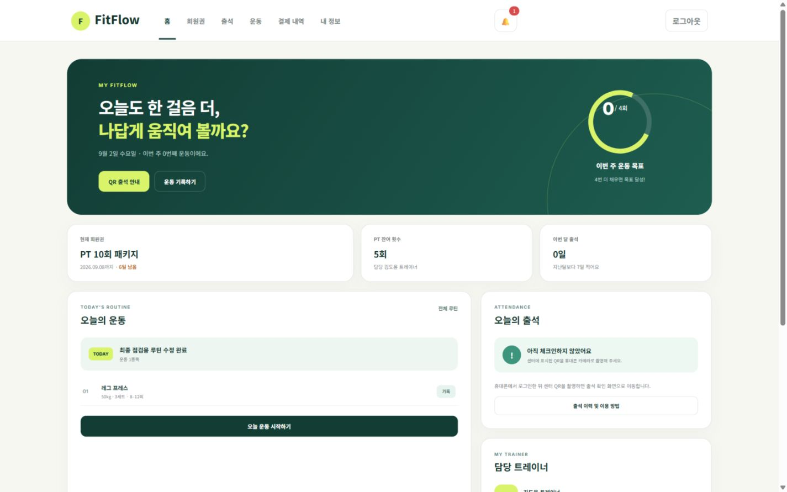
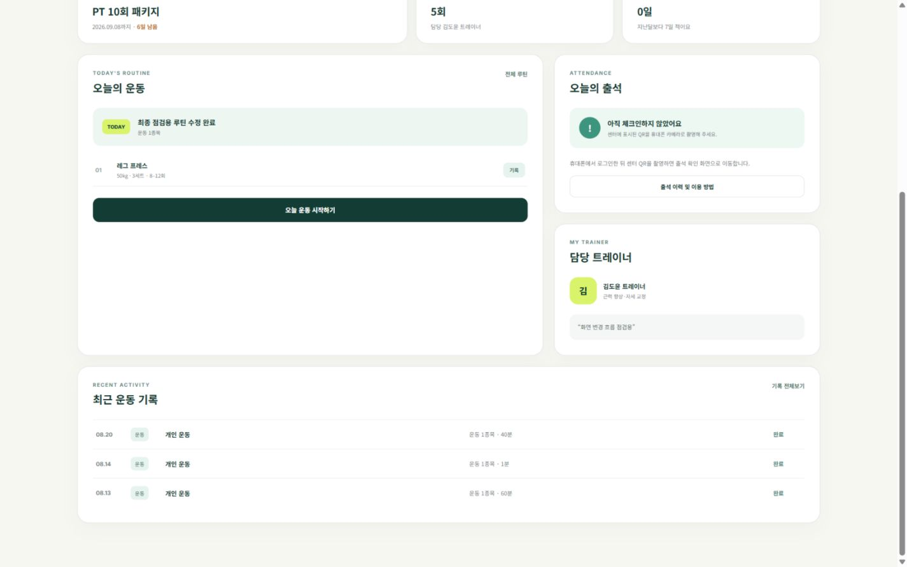

# Gymrovia

Gymrovia는 회원, 회원권·결제, 출석, 예약, 운동, 시설 업무를 한곳에서 처리하는 헬스장 운영 관리 웹 애플리케이션입니다. 관리자·트레이너·회원 역할별 화면과 접근 권한을 제공합니다.

> 핵심 MVP를 구현하고 결제 정합성, 예약 동시성, 권한별 오류 처리처럼 운영 환경에서 발생할 수 있는 문제까지 보완했습니다.

📚 [Notion 설계 문서](https://app.notion.com/p/Gym-Management-System-6454d948da9c835bb3b501c48f3d275b) — 프로젝트 기획, 요구사항, ERD·테이블 정의, 화면·API 설계, MVP·확장 범위와 개발 일지

## 프로젝트 개요

| 항목 | 내용 |
| --- | --- |
| 개발 기간 | 2026.07.29 ~ 2026.09.02 |
| 개발 인원 | 1명, 개인 프로젝트 |
| 담당 범위 | 기획, 요구사항 정의, DB 설계, 백엔드, 화면 구현, 테스트 |
| 프로젝트 형태 | Spring Boot 기반 헬스장 운영 관리 시스템 |

## 주요 기능

### 관리자

- 운영 대시보드와 매출·출석 통계 조회
- 회원 등록·조회·수정 및 트레이너 배정
- 회원권 상품과 회원별 회원권 관리
- 현장 결제, Toss Payments 결제 및 전체·부분 환불 관리
- 출석 체크인·체크아웃과 센터 QR 발급
- 트레이너 일정 예약 생성·수정·상태 관리
- 시설과 점검 이력 관리
- 알림 조회 및 읽음 처리

### 트레이너

- 담당 회원 목록과 상세 정보 조회
- 회원별 운동 루틴 작성·수정·삭제
- 일일 운동 기록 작성·수정·삭제
- 트레이너 프로필 관리

### 회원

- 보유 회원권과 결제·환불 내역 조회
- Toss Payments 결제창을 통한 회원권 결제
- QR 기반 체크인·체크아웃
- 운동 루틴 조회와 운동 기록 작성·수정
- 프로필 및 비밀번호 변경
- 알림 조회

## 주요 화면

> 아래 실행 화면은 이름 변경 전 촬영한 자료입니다. 현재 화면의 브랜드는 Gymrovia이며, 이미지는 재촬영 후 교체할 예정입니다.

| 로그인 | 관리자 대시보드 |
| --- | --- |
|  |  |

| 트레이너 홈 | 회원 홈 |
| --- | --- |
|  |  |

### 회원 홈 상세



역할별 전체 화면 설계와 구현 범위는 [Notion 설계 문서](https://app.notion.com/p/Gym-Management-System-6454d948da9c835bb3b501c48f3d275b)에서 확인할 수 있습니다.

## 주요 기술 문제 해결

### PG 승인 후 로컬 저장 실패

**문제**

Toss Payments 승인은 성공했지만 로컬 DB 저장이 실패하면 고객의 금액만 결제되고 회원권은 활성화되지 않는 상태가 발생할 수 있었습니다.

**해결**

- PG 승인과 로컬 저장 단계를 분리하고 주문 상태 전이를 명시적으로 관리
- 로컬 저장 실패 시 Toss Payments 취소 API를 호출해 승인 금액 자동 취소
- 자동 취소 성공 시 `COMPENSATED`, 실패 시 `RECONCILIATION_REQUIRED` 상태로 주문 보존
- 승인과 취소 요청에 멱등성 키를 적용해 중복 처리 방지

**결과**

PG와 로컬 DB 상태가 불일치하면 자동으로 복구하고, 자동 복구가 불가능한 주문은 관리자가 식별할 수 있게 했습니다.

### 실제 PG 환불과 로컬 상태 정합성

**문제**

로컬 DB에서만 환불 상태를 변경하면 Toss Payments의 실제 승인 금액은 취소되지 않습니다.

**해결**

- Toss Payments 결제에는 PG 취소 API를 먼저 호출한 후 환불 결과 저장
- 현장 결제와 PG 결제를 결제수단에 따라 분기
- 전체·부분 환불 금액과 상태 전이를 검증하고 전액 환불 시 회원권도 함께 취소
- 관리자 회원권 취소 시 연결된 결제 대기 주문도 함께 취소

**결과**

PG의 실제 취소 결과와 결제·환불·회원권 상태가 함께 변경되도록 구성했습니다.

### 트레이너 일정 동시 예약

**문제**

일정 중복 확인과 예약 저장 사이에 동시 요청이 들어오면 같은 트레이너에게 겹치는 예약이 저장될 수 있었습니다.

**해결**

- 예약 생성·수정 트랜잭션에서 트레이너 행을 `SELECT ... FOR UPDATE`로 잠금
- 잠금을 획득한 후 트레이너 일정 중복 여부 검사
- 충돌이 발견되면 `409 CONFLICT`로 저장 차단

**결과**

같은 트레이너의 예약 요청이 순차적으로 처리되어 동시 요청에서도 겹치는 일정이 저장되지 않도록 했습니다.

### 화면과 API의 오류 응답 분리

**문제**

일반 화면의 비즈니스 오류가 JSON으로 표시되거나 권한 오류가 기본 텍스트 화면으로 노출되면 사용자 경험이 일관되지 않습니다.

**해결**

- 일반 화면 요청은 Gymrovia 전용 HTML 오류 화면으로 처리
- `/api/**` 요청은 공통 `ApiResponse` JSON 형식으로 반환
- 인증·권한·검증·충돌·외부 PG 오류에 적절한 HTTP 상태 코드 적용

**결과**

사용자는 일관된 Gymrovia 오류 화면을 보고, API 클라이언트는 구조화된 오류 코드와 상세 메시지를 받을 수 있습니다.

## 기술 스택

| 구분 | 기술 |
| --- | --- |
| Backend | Java 17, Spring Boot 4, Spring MVC |
| Security | Spring Security, Google OAuth 2.0 |
| Persistence | MyBatis, MySQL |
| Frontend | Thymeleaf, HTML, CSS, JavaScript |
| Payment | Toss Payments API·SDK |
| Build & Test | Gradle, JUnit 5, Mockito, H2 |

## 아키텍처

기능별 도메인 패키지 구조를 사용하며 기본 처리 흐름은 다음과 같습니다.

```text
Controller → Service → Mapper → XML Mapper → MySQL
                         ↓
                    External Gateway
```

- `Controller`: 화면·API 요청 처리와 입력 검증
- `Service`: 비즈니스 규칙과 트랜잭션 경계 관리
- `Mapper / XML Mapper`: MyBatis 기반 데이터 접근과 SQL 관리
- `Gateway`: Toss Payments 등 외부 시스템 연동
- `Scheduler`: 결제 주문 만료 및 QR 임시 데이터 정리
- `GlobalExceptionHandler`: 일반 화면과 API 오류 응답 분리

세부 구조는 [PROJECT_STRUCTURE.md](PROJECT_STRUCTURE.md)에서 확인할 수 있습니다.

## 테스트 범위

- 핵심 서비스 비즈니스 규칙 단위 테스트
- 결제 승인 실패와 승인 후 저장 실패 보상 테스트
- Toss Payments 환불 요청 및 로컬 상태 반영 테스트
- 역할별 접근 제어 테스트
- 일반 화면과 API 예외 응답 분리 테스트
- 트레이너 예약 잠금과 일정 충돌 차단 테스트

```powershell
.\gradlew.bat test
```

## 실행 방법

### 사전 준비

- Java 17
- MySQL 8
- Toss Payments 테스트 API 개별 연동 키
- Google OAuth 클라이언트

### 데이터베이스 준비

DB 스키마는 Flyway로 관리합니다. 신규 환경에서는 빈 MySQL 데이터베이스를 만든 뒤 접속 환경변수를 설정하고 애플리케이션을 실행하면 `src/main/resources/db/migration`의 마이그레이션이 자동 적용됩니다.

로컬 시연 데이터가 필요하면 마이그레이션 완료 후 `docs/db/sample-data.sql`을 선택적으로 실행합니다. `docs/db/schema.sql`은 전체 구조 확인과 수동 초기화를 위한 참고 파일이며, 기존 테이블을 제거하므로 데이터가 있는 DB에는 실행하지 않습니다.

기존 DB의 Flyway 등록과 변경 적용 방법은 [DB 설정 문서](docs/db/README.md)를 참고하세요.

### 환경변수

프로젝트 루트의 `.env` 파일 또는 IDE 실행 설정에 다음 값을 지정합니다. 실제 키와 비밀번호는 Git에 커밋하지 않습니다.

```properties
DB_URL=jdbc:mysql://localhost:3306/gym_management
DB_USERNAME=사용자명
DB_PASSWORD=비밀번호
GOOGLE_CLIENT_ID=Google 클라이언트 ID
GOOGLE_CLIENT_SECRET=Google 클라이언트 시크릿
TOSS_CLIENT_KEY=Toss 테스트 클라이언트 키
TOSS_SECRET_KEY=Toss 테스트 시크릿 키
```

```powershell
.\gradlew.bat bootRun
```

## 문서

- [Notion 설계 문서](https://app.notion.com/p/Gym-Management-System-6454d948da9c835bb3b501c48f3d275b)
- [프로젝트 구조](PROJECT_STRUCTURE.md)
- [API 명세](docs/api-spec.md)
- [인증 흐름](docs/auth-flow.md)
- [데이터베이스 설정 및 마이그레이션](docs/db/README.md)
